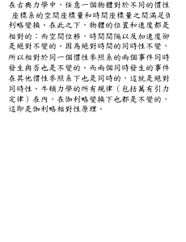

# zhtw2img
### Requirement: PIL
    $ pip3 install image

### Example
```python
from text2img import zhtw2img

s = u'''
在古典力學中，任意一個物體對於不同的慣性
座標系的空間座標量和時間座標量之間滿足伽
利略變換。在此之下，物體的位置和速度都是
相對的；而空間位移，時間間隔以及加速度卻
是絕對不變的。因為絕對時間的同時性不變，
所以相對於同一個慣性參照系的兩個事件同時
發生與否也是不變的。而兩個同時發生的事件
在其他慣性參照系下也是同時的，這就是絕對
同時性。牛頓力學的所有規律（包括萬有引力
定律）在內，在伽利略變換下也都是不變的，
這即是伽利略相對性原理。
'''

# zhtw2img(text, img size, ttf file path), return PIL Image and image array
img_array, img = zhtw2img(s, size=(230, 300), ttf='kaiu.ttf')
```

```python
img
```





```python
img_array.shape
```


(300, 230, 3)


